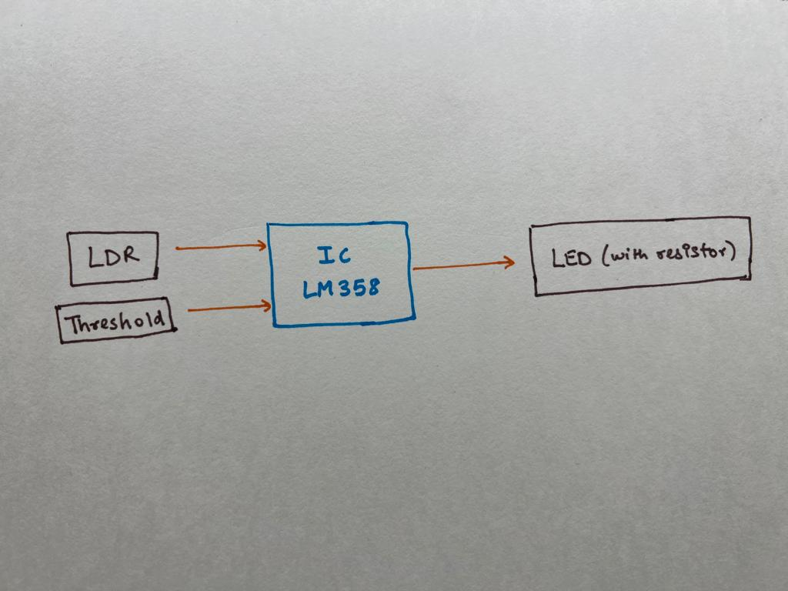
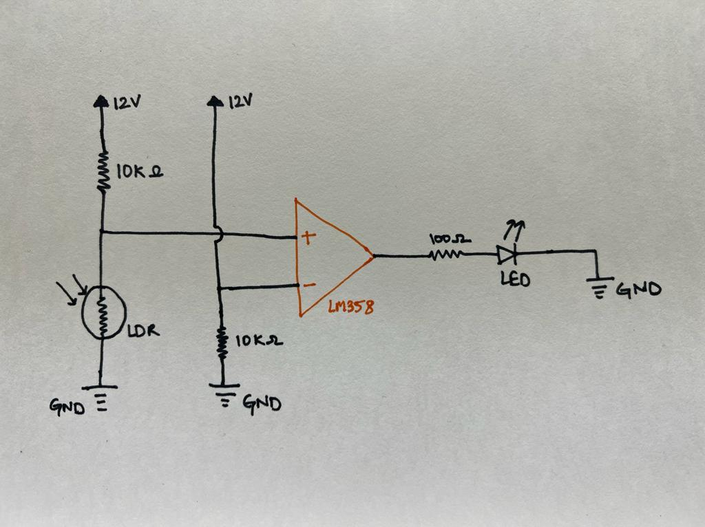

## Description

Have you ever heard of Automatic Headlights? It basically means that the headlights will turn ON when its dark and during day-time, the headlights will turn OFF. This serves as a feature in many luxurious cars. In this problem statement, you have to design one!

## Problem Statement

In this task, you have to design a PCB for Automatic Headlights which means that the lights will turn ON when its dark and vice versa. For this, you need few components like:
1. **LDR (Light Dependent Resistor):** An LDR is a component that has a (variable) resistance that changes with the light intensity that falls upon it. In case of dark environment, the resistance value becomes very high and vice versa.
2. **LM358 (Comparators):** From the name itself it is clear that this is an Op-Amp that compares two voltages, one is a SET voltage and other one is the incoming voltage (through LDR) and correspondingly generate a HIGH or LOW output. In case of HIGH condition, the LED/ headlight shall glow. Read more about the **IC LM358** if it is still not clear.

**BLOCK DIAGRAM AND CIRCUIT DIAGRAM ARE GIVEN BELOW:**






## Submission Instructions: (KiCAD software is recommended)

```
1. Submit a PDF that includes the snapshots of the following things:
	- Schematic Diagram
	- PCB Layout (Both front layer and back layer)
2. Along with the PDF, submit a zip folder that contains all the KiCAD files and rename it as your team name and task number. Eg. "Task_4_TEAM_ABCD"
3. You need to import the symbols and footprints of all the components like LM358 and LDR, so you can download it from the EDA Tools websites provided in Resources Section.
```


## Resources:

1. KiCAD Installations: (Follow all the steps carefully)
	- [Linux](https://www.kicad.org/download/linux/)
	- [Windows](https://www.kicad.org/download/windows/)
	- [MacOS](https://www.kicad.org/download/macos/)

2. **KiCAD Playlist:** 
	[Click here](https://www.youtube.com/playlist?list=PL3bNyZYHcRSUhUXUt51W6nKvxx2ORvUQB)

3. EDA Tools for importing components:
	- [SnapEDA](https://www.snapeda.com/)
	- [Component Search Engine](https://componentsearchengine.com/)